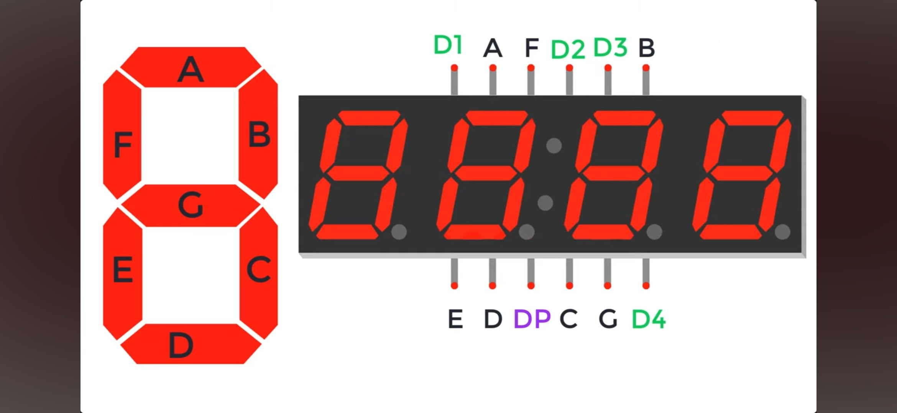
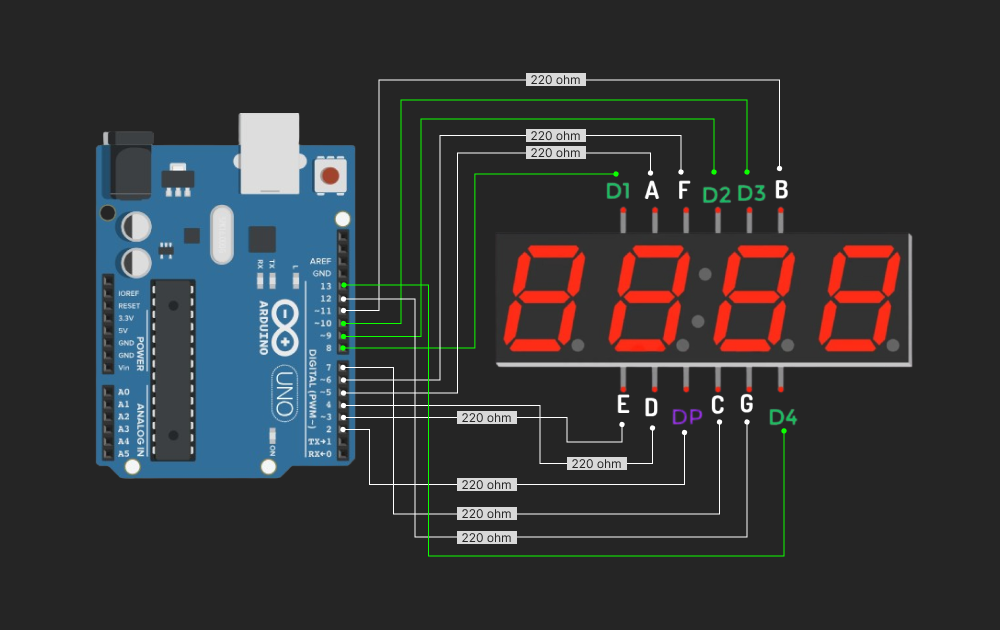

### Simple Guide for 4 digit 7 segment LED Display

It is only intended for 4 digit display. I've a cathode display,
since LED display has two main types, anode and cathode. Using
anode current flows from positive while the cathode is the opposite 
which used ground to turn LEDs on, so it means it is a way to identify
how the LED could be turn on.

Displaying numbers require knowledge on which pin is which. In this case 
the 4 digit display has 12 pins. Each pins designated to corresponding
segment or switch. Thereby understanding each of them makes thing
smoother to work on.

It consists of 4 common cathode/anode pins, as switches for each digit, 
and 7 segment pins, commonly referring as a,b,c,d,e,f and g from top 
turning around(clock wise) until reaching center which is the g segment. 
Additionally it consists of decimal point pin.

The way it works is it only has a single register for segments, as
shared register between common cathode pins(switch). Therefore turning 
on all segments while digit 1(switch 1) and 2(switch 2) are open make 
there segments also on.

Keep in mind to include resistors around 200 to 1k ohms to ensure LEDs
will not blow up.

Digit switch not require additional components so just connect it to
designated digital pins on arduino.

