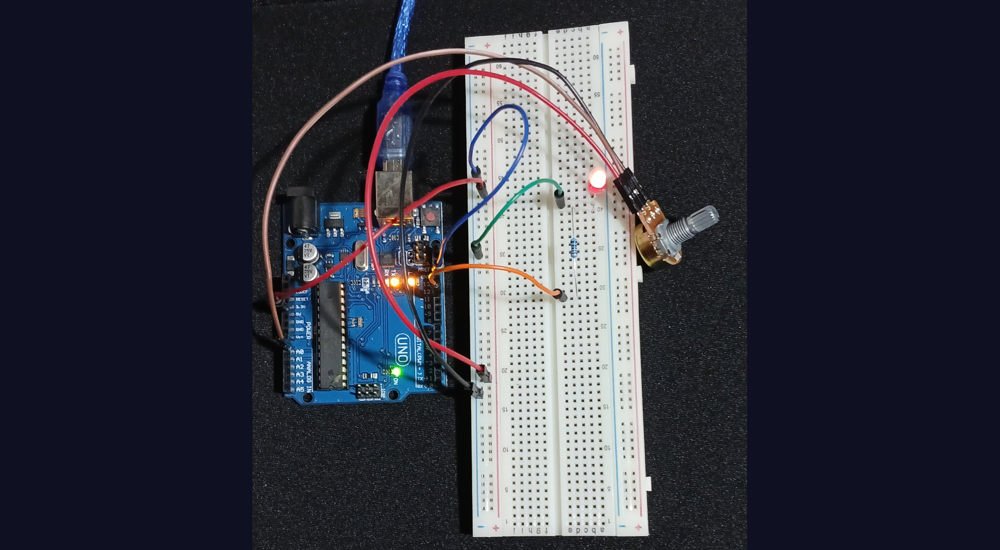
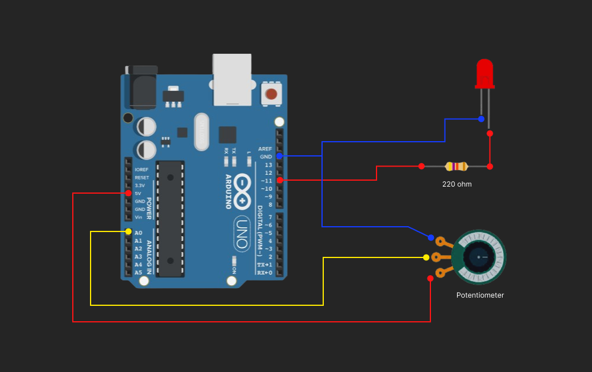

### Control LED Brightness Using Potentiometer

Here's a simple circuit and program in AVR Arduino in C programming
that allows analog input from potentiometer to converts to digital(ADC)
value. The value will controls the brightness of LED by rotating potentiometer
handle 180 degress clock wise to increase or counter clock wise to decrease 
LEDs brightness.



Potentiometer has three pins. It is like resistor with capability to regulate
the amount of voltage passing through circuit. Rotating it makes contact forming 
an adjustable voltage divider. The middle pin acts as bridge, so making small
turn creates little contact to flow the current, and to allow our program to get
value from analog to digital value. This digital value is only 10 bits(2^10-1) = 1023,
so 0 to 1023 is full turn. Both outer pins is the opposite connection, left pin are
positive while right pin is negative.



In this circuit the middle pin is connected to Analog pin(A0) in Analog pins section 
since this is the only way to interact to analog components in arduino to get digital
value. The 5v coming from VVC power, supplies current while waiting for input.I also 
set up an LED to control its brightness as it depends on potentiometer input. LED's
brightness only acquire maximum value of 255, so this is the simple equation to only
get 0-255 from 0-1023.

```math
brightness = (ADC Input * 255) / 1023
```

I also used serial communication here just to inspect the potentiometer value and the
convertion of value for brightness.
