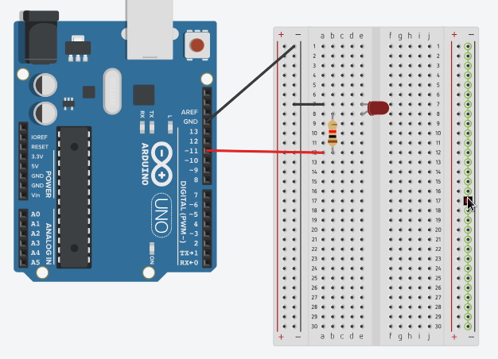
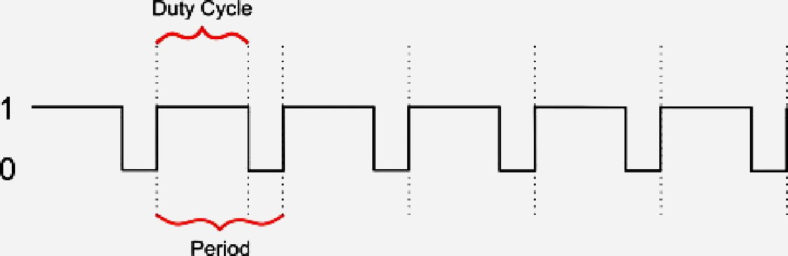

### Pulsing LED



```c
DDRB |= (1 << DDB3);
```

This is pin 11 in digital pins. This kind of pin is different from other pins(I/O) since 
it has additional feature of converting digital value to analog like working with current 
by controlling its voltage like voltage regulator is not possible here since it is just 
a mini board and achieving such function requires external hardware so the analog that I'm 
saying is similar to frequency. It is called PWM(Pulse Width Modulation) where the digital 
value will be converted to frequency so it generates pulses like square waves. Thereby the 
value it gets the longer that pulse will stay on high state. So it means that it is all based 
on time by turning device on and off depends on frequency on high speed to achieve the illusion 
that device continously gets power base on user control like dimming an LED or control motor
speed. It is quite hard for human eye to perceive this trick because it happens in milliseconds. 
Additionally identifying these pins is really easy since they have (~) sign in front of their 
pin number.



```c
TCCR2A = 0;
TCCR2B = 0;
```

Resets the values of these registers, so it cannot be interfered by previous values which
causing weird behaviour.

```c
TCCR2A |= (1 << WGM2A);
```

Setting Phase Correct PWM mode, it means this register tells timer2 to only count 0 - 255.

```c
TCCR2A |= (1 << COM2A1);
```

It triggers the timer to pulse like frequency from 0 to 255 and 255 to 0, generates square
wave like, giving full controll over device power.

```c
TCCR2B |= (1 << CS22);
```

CS22 is a prescale, help to avoid flickering. There are different prescale values which might
be used, but CS22 might be the smoother one. Prescales are based on CPU clock speed which
is 16Mhz(Arduino's microcontroller) and the value of CS22 is 32*2=64, so the computation will
be CPU/(CS22*256), 16Mhz/(2*32*256) is approximately 976hz. The 976hz will be used by pin 11(PWD)
as needed frequency.

```c
OCR2A;
```

Is a regiter acquire 8 bit value(input) which be then used by analog pin(pin 11) in digital pin
as to convert to frequency.
