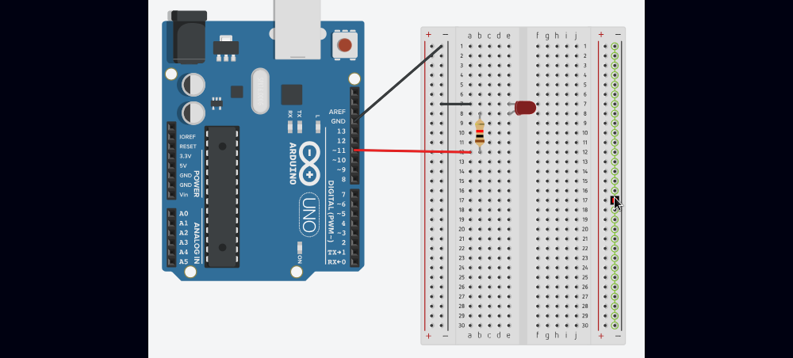

### Pulsing LED



```c
DDRB |= (1 << DDB3);
```

This pin 11 is part of digital pins thought it converts analog to digital the frequency.
This is commonly known as Pulse Width Modulation(PWM). Thereby it provides additional
features, it means controlling supply of current by turning it on and off is possible in
certain time frame.

```c
TCCR2A = 0;
TCCR2B = 0;
```

Resets the values of these registers, so it cannot be interfered by previous values make
weird behaviour.

```c
TCCR2A |= (1 << WGM2A);
```

It will set the Phase Correct PWM mode, it means this register tells the timer2 to count
up from 0 to 255, then 255 down to 0.

```c
TCCR2A |= (1 << COM2A1);
```

Makes the counting of timer from 0 to 255 and 255 down to 0 like tringle wave. Helps to
make pulsing of LED smoother.

```c
TCCR2B |= (1 << CS22);
```

It is a prescale, help to avoid flickering. These are different prescale values which might
be used but CS22 might be the smoother one. These prescale are based on CPU clock speed which
is 16Mhz(Arduino's microcontroller) and the value of CS22 is 32*2=64, so the computation will
be CPU/(CS22*256), 16Mhz/(2*32*256) is approximately 976hz. The 976hz will be used by pin 11(PWD)
as needed frequency.


```c
OCR2A;
```

From microcontroller holds values which be then passed to pin 11, since this is hardware
connected to.

