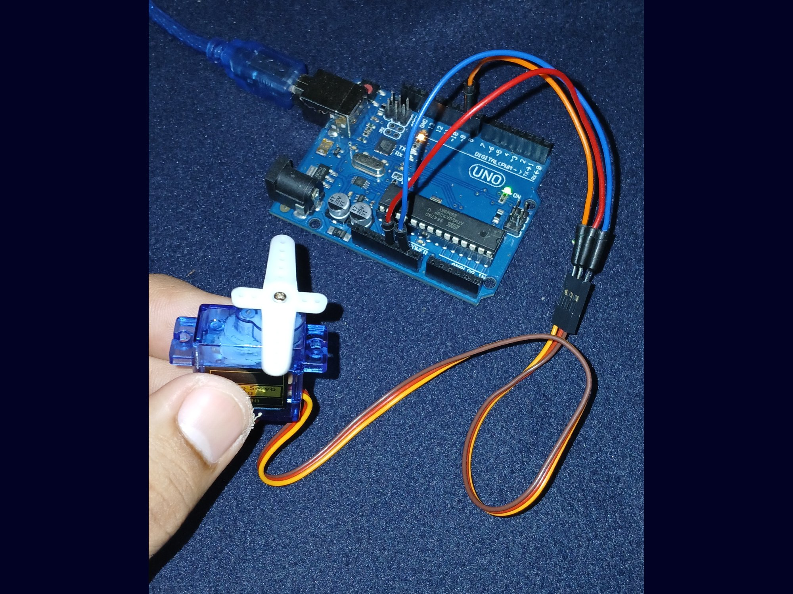

Rotating Servo



Every pins with corresponding sign(~) in fron of number in arduino's digital pins
are connected to specific timer's output compare register.

Mapping:

- Pin 3 ~ - OC2B(Timer 2)
- Pin 5 ~ - OC0B(Timer 0)
- Pin 6 ~ - OC0A(Timer 0)
- Pin 9 ~ - OC1A(Timer 1)
- Pin 10 ~ - OC1B(Timer 1)
- Pin 11 ~ - OC2A(Timer 2)

Each timer(Timer 0, Timer 1, Timer 2) has different capabilities

- Timer 0 and Timer 2 are 8 bit timers(value ranging from 0 - 255)
- Timer 1 is 16 bit timer which capable for precise value because it's ranging from
0 - 65535, so it is mor use for servos.

```c
TCCR1A = 0;
TCCR1B = 0;
```

Reset to ensure previous values are removed.

```c
ICR1 = 40000
```

The ICR1 set to 40,000 as TOP to achieve 50hz as servo's expected value. The timer 1
is 8 bit and the microcontroller's clock speed is 16Mhz so the computation will be:

```math
CPU clock / (Timer1 * TOP)
16000000(2^8 * 40000)
```

Thereby ICR1 is a register that holds value for the speed of frequency of Timer1.

Both TCCR1A and TCCR1B are both 8 bit registers used just to hold the combination to
define how the timer should behave. So the combination for Fast PWD mode is WGM11,
WGM13, WGM12.

```c
TCCR1A |= (1 << COM1A1) | (1 << WGM11);
TCCR1B |= (1 << WGM13) | (1 << WGM12) | (1 << CS11);
```

Additionally the CS11 used to configure the timer to used 8 bit as its prescale.

```c
COM1A1
```

It is really important to understand it to visualised how timer's frequency will work.
It will clear on compare the value coming from timer's output compare register(OCR1A)
for pin 9 to defined maximum frequency which is 50hz. Since we are using Timer1 if the
input value(OCR1A) is equal to 50hz the frequency will drops to zero immediately.

```c
OCR1A
```

Accepts input value from 0 to 5000 to rotate servo 180 degrees.
