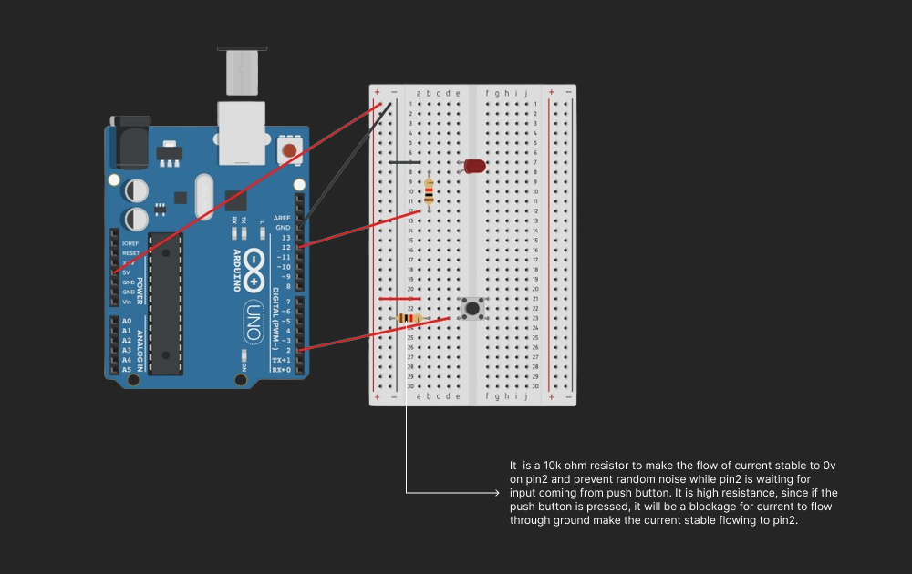

### Push Button Switch

Here's a really simple circuit and code using avr in C program.
In this circuit the 10k ohm resistance is included to prevent unwanted
noise and it is connected to ground and give 0v to input pin making 
it stable and avoid random noise since the pin 2 on Arduino Uno waiting 
for input or current from button. The 5v Arduino power pin will provide 
current when button is pressed, so button acts as a bridge to trigger 
digital pin 2. Additionally 10k ohm blocks the current from button
when pressed to prevent it to proceed to ground.

